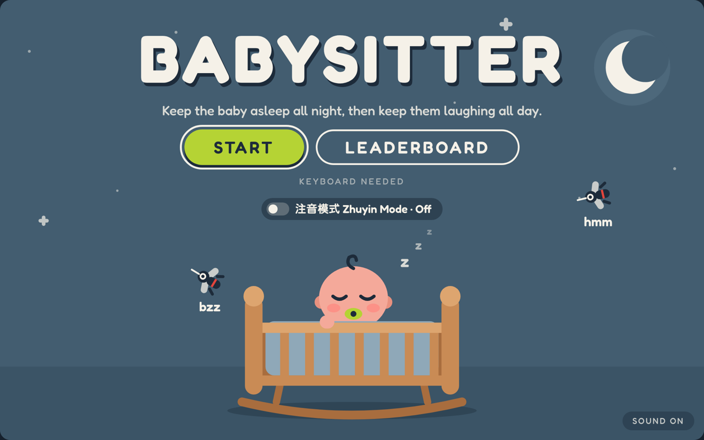
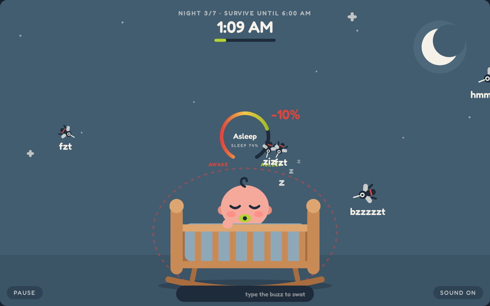
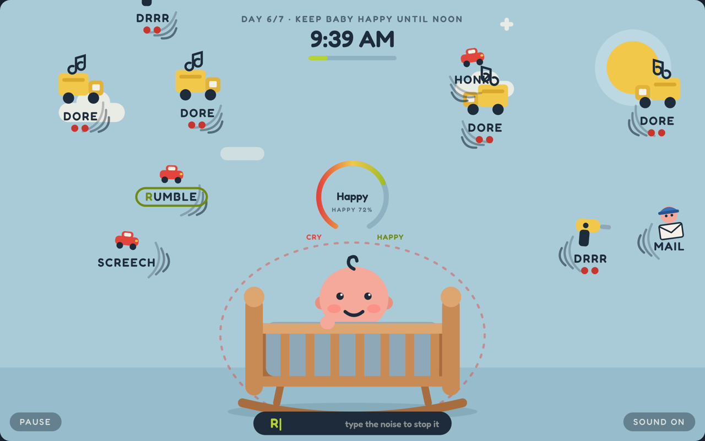
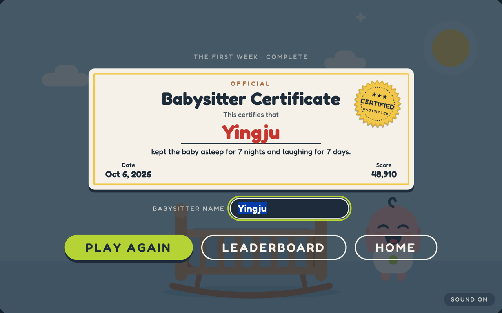

# Master AI Prompt Log & Workflow Analysis

**Course:** AME 294: Games and AI — Creating Games with Artificial Intelligence  
**Assignment:** Portfolio Game 2 — Vibe-Coded Browser Game  
**Student Name:** Ying-Ju Chen  
**Project Title:** Babysitter  
**Repository URL:** [https://github.com/yche1364-YJ/game-babysitter](https://github.com/yche1364-YJ/game-babysitter)  
**Play Online (GitHub Pages):** [https://yche1364-yj.github.io/game-babysitter/](https://yche1364-yj.github.io/game-babysitter/)  
**Itch.io URL (Optional Bonus):** —

> **Babysitter** is a cozy typing game built on a Chinese pun: 打蚊子 (swatting mosquitoes) sounds almost the same as 打文字 (typing words). Mosquitoes fly at the crib at night and noises float in during the day. The player types each pest's sound to stop it. Survive seven nights and seven days to earn a Babysitter Certificate. A 注音 Zhuyin mode lets players type Zhuyin key positions instead of English.

---

## 1\. Toolchain & AI Session Inventory

| Category | Primary Tool / Platform | Model Version / Specification | Purpose in Project |
| :---- | :---- | :---- | :---- |
| **Code Scaffolding Agent** | Claude (Cowork mode, Claude desktop app) | `claude-opus-5-5` (identifier shown in the session) | Concept write-up, SVG mockups, single-file `index.html` with an SVG scene and a `requestAnimationFrame` game loop |
| **Logic & Debugging Agent** | Claude (same session) | `claude-opus-5-5` | Typing/lock-on logic, enemy behaviours, night/day loop, scoring, leaderboard, Zhuyin key mapping, bug fixes, automated play-testing with a Playwright typing bot |
| **Audio / SFX Generator** | ElevenLabs | ElevenLabs Sound Effects | Day hit "pop", night "slap", baby crying on game over |
| **Music / Atmosphere** | ElevenLabs | ElevenLabs Sound Effects | 10-second "cute and cozy" looping background track |
| **Visual Asset Pipeline** | Claude, drawing vector art directly as inline SVG code | `claude-opus-5-5` | Baby, crib, mosquitoes, flies, cockroach, mouse, day-noise icons, gauge, certificate. Flat style based on a reference image I supplied. |
| **Fonts** | Google Fonts | Fredoka, Huninn 粉圓 | Rounded UI font; cute rounded font for Zhuyin |
| **Audio processing** | Claude (ffmpeg + Python in its sandbox) | — | Trimming silence, fades, volume, pitch, loop check, embedding audio in `index.html` |

---

## 2\. Code Development Prompts (Reward — Damage — End Loop)

*My prompts were written in Chinese. Each is quoted exactly, followed by an English translation.*

### 2.1 Initial Setup & Boilerplate Scaffolding

* **Date / Session:** `2026-10-03`  
* **Agent Used:** Claude (Cowork)  
* **Target Objective:** Turn the idea into a concept, then build a playable browser game with a title page, a night level and a day level.

#### Exact Prompt Submitted:

Concept:

> 我要做一個網頁遊戲 我有一些點子
> 媽媽打文字 讓小孩睡覺 所以基本上是射擊遊戲 只是是打文字 然後文子愈靠近小孩，小孩就會哭 所以我要在蚊子叮到寶寶之前打死文子 這個邏輯懂嗎
> 幫我順一下 給我簡述的英文概要

*(I want to make a web game. Mom "types words" (打文字) to get the kid to sleep, so it's a shooter where you type. The closer the mosquito (蚊子) gets, the more the baby cries, so I have to kill it before it bites. Smooth out the logic and give me a short English summary.)*

First build, after about ten rounds of mockups and art direction:

> 好 幫我做 這是browser game會有三個葉面 首頁 點進去 第一關 然後時間到了會出現第二關(白天)
> 第一關的時間和第二關會輪替 你可以幫我看看哪個時間配置 玩家部會無聊玩膩

*(OK, build it. It's a browser game with three pages: the home page, then level 1, and when time runs out level 2 (daytime). Levels 1 and 2 alternate. Help me pick timings so players don't get bored.)*

#### Agent Output Summary & Key Changes:

* One self-contained `index.html`: inline CSS, an SVG scene (960×600 viewBox, scales to the window), HTML overlays for the title, cards, pause and game-over screens, and a single `requestAnimationFrame` loop. No libraries.
* All tunable numbers were put in one `CONFIG` object at the top so the game can be edited later (including with other AI tools).
* It ran on the first try. The agent's own screenshot test found one bug immediately: every overlay was visible at once (see Incident 1).

---

### 2.2 Implementing the Core Gameplay Triad (Reward — Damage — End)

* **Date / Session:** `2026-10-03` to `2026-10-06`  
* **Agent Used:** Claude (Cowork)  
* **Target Objective:** Program the three foundational gameplay pillars.

#### A. Reward Mechanic Prompt:

> 那你覺得要下一關嗎
> 下一關卡會變成白天 然後是樓上施工的噪音 窗戶外的噪音 依樣有文字 然後寶寶是醒著 但是寶寶一職哭 要點調噪音 (一樣的玩法) 寶寶財部會哭 才會笑

*(Should there be a next level? It becomes daytime, with construction noise upstairs and noise outside the window, still as words. The baby is awake and crying; you type away the noises (same gameplay) so the baby stops crying and laughs.)*

> 然後最後有一個排名 所有完過人的人 你是babysister第幾名這種

*(And at the end, a ranking of everyone who has played: "you are babysitter #N".)*

> 我覺得可以每一輪每關各加一個敵人

*(Each round, each level should add a new enemy.)*

* **Implementation Outcome:** Every word typed is a hit: a burst ("SLAP!" at night, "POW!" by day), +10 × round points, and by day +3% happiness. Surviving a level adds +100 × round. Each round introduces a new character with a picture card. Game-over shows the score and the player's rank ("You're the #2 babysitter out of 12"), saved to a shared leaderboard.

#### B. Damage & Hazard Mechanic Prompt:

> 扣分的部分 幫我改成10%
> 然後用程度來描述開心到哭 睡到醒 不用秒數

*(Make the penalty 10%, and describe the meter as levels from happy to crying and asleep to awake, not seconds.)*

* **Implementation Outcome:** A ring gauge shows the baby's state in words (Deep sleep → Asleep → Restless → Stirring → Waking!, and Giggling → … → Crying!) plus a percentage. A pest reaching the baby costs 10%, a wrong key 2%, and pests inside the red danger ring drain it every second. The baby's face changes with the meter.

#### C. End State & Win/Loss Condition Prompt:

> 一個明確的結局，例如撐過七天就破關
> 最後會出現一個寶寶開心爬出搖籃的小動畫

> 然後寫保母證書 這種的

*(A clear ending: survive seven days to win, then a short animation of the baby happily climbing out of the crib. Then a babysitter certificate.)*

* **Implementation Outcome:** Losing (meter at 0%) shows "The baby woke up" or "The baby started crying" with stats, a name box, Save score, Play again, Leaderboard and Home. Winning day 7 plays the climb-out animation with confetti, then a Babysitter Certificate with the player's name, date, score and a CERTIFIED seal.

---

### 2.3 Wiring Up the Web Audio API & Audio Triggers

* **Date / Session:** `2026-10-06`  
* **Agent Used:** Claude (Cowork)  
* **Target Objective:** Load my audio files, attach them to game events, and unlock audio after a user gesture.

#### Exact Prompt Submitted:

> 我想加一些音效，背景音樂我想要放一個可以一直loop的聲音
> 我給你檔案

> 如果玩家輸了 寶寶哭的時候 請播放這個音效

> 當白天擊破一個聲音出現Pow時 改這個音效（你可以稍微幫我調整合適的播放點）

> slap的聲音用這個 一樣小聲一點

> 請確保所以音效白天都是pow音效
> 晚上都是slap

*(Add sound effects and a looping background track — here are the files. Play this crying sound when the player loses. Use this sound for POW by day and adjust where it starts. Use this one for slap, quieter. Make sure every daytime hit is the pow and every night hit is the slap.)*

#### Implementation Outcome:

* One `AudioContext`, created and resumed on the player's first click or key press (browser autoplay policy). The cry and hit sounds are pre-decoded at that moment so they play with no delay.
* The music loops gaplessly through an `AudioBufferSourceNode` with `loop = true` (an `<audio loop>` tag leaves a gap). A low-pass filter and gain change with the scene: muffled and quiet at night, bright by day, ducked when paused or after losing.
* Hits play the recorded pop (day) or slap (night). Losing plays the baby crying. Separate volume settings: `musicVolume`, `popVolume`, `slapVolume`, `cryVolume`.
* Smaller cues (key click, lock-on ping, baby whimper, countdown bell, giggle, damage tone, win jingle) are synthesized with Web Audio oscillators.
* The audio is embedded in `index.html` as base64 so the single file works offline. Copies are in `assets/audio/`.

---

## 3\. Generative Audio & Sound Design Prompts

### 3.1 Sound 1: Reward SFX

* **Target Event:** A pest is stopped — daytime "POW!" (and a second sound for the night "SLAP!")  
* **Audio Generator:** ElevenLabs Sound Effects  
* **Exact Prompt / Acoustic Descriptors:**  

  Day pop:
  > One sharp and crisp bubble pop: "pow!" Clean, punchy, playful, and cartoon-like. Single sound only, very short, no reverb or background noise.

  Night slap:
  > One sharp: "slap" cute, playful, and cartoon-like. Single sound only, very short, no reverb or background noise.  

* **Iterations & Refinements:**  
  * Pop: the 1-second file had 0.27 s of silence before the sound. It was trimmed to 0.3 s so the pop lands with the visual burst, given a short fade, and lowered from 0.9 to 0.45 after play-testing ("波 聲音可以小一點" — the pop can be quieter).
  * Slap: this took six rounds. The raw slap felt too sharp against the soft music (about a third of its energy was above 3 kHz). Filtered and synthesized versions were rejected ("一樣是 啪 打蚊子的聲音 只是不要那麼響 卡通感 俏皮一點" — still a slap, just not so loud, more cartoonish and playful). Final: the recording sped up 1.2× (higher, shorter, more cartoon-like), highs rounded off, 0.13 s, volume 0.35.  
* **Exported Filename:** `/assets/audio/reward_day_pop.wav`, `/assets/audio/reward_night_slap.wav`

---

### 3.2 Sound 2: Damage SFX

* **Target Event:** A pest reaches the baby (−10%), and a pest enters the red danger ring  
* **Audio Generator:** Created by Claude in code (Web Audio API oscillators), under my direction  
* **Exact Prompt / Acoustic Descriptors:**  

  There was no separate audio-generator prompt. The damage sound was built by the coding agent as part of the game, following my build request in Section 2.1 and my sound request in Section 2.3 ("我想加一些音效" — *I want to add some sound effects*). I reviewed it in play-testing and kept it quiet so it doesn't compete with the music and the crying sound.  

* **Iterations & Refinements:** The hit is a short falling sawtooth "ouch" tone with a shake of the baby. A soft two-note whimper plays when a pest enters the danger ring, limited to once every 2.5 seconds so it never stacks.  
* **Exported Filename:** — (generated at runtime)

---

### 3.3 Sound 3: End State SFX

* **Target Event:** Game over — the baby wakes up or starts crying  
* **Audio Generator:** ElevenLabs Sound Effects  
* **Exact Prompt / Acoustic Descriptors:**  

  > making the crying baby sound, soft and not too annoying and more cute not too sharp like baby just starting to cry  

* **Iterations & Refinements:** 5-second clip, converted to mono 24 kHz to keep the page small, with a 0.4 s fade-out because the original ended abruptly. Plays at 0.8 while the music drops to a quiet "game over" level so the cry stands out. Winning uses a synthesized four-note jingle with confetti instead.  
* **Exported Filename:** `/assets/audio/end_baby_cry.wav`

---

### 3.4 (Optional) Ambient Music / Background Soundscape

* **Target Purpose:** Looping background music for the whole game  
* **Tool Used:** ElevenLabs Sound Effects  
* **Prompt & Settings:**  

  > Cute and cozy game background music with low-pitched marimba and soft wooden percussion. Warm, bouncy "boom boom" notes, playful and gentle, medium tempo. Avoid high-pitched xylophone, bells, chimes, and crystal sounds. good for night  

  Analysis: 10.0 s, loops cleanly (near-zero samples at both ends), roughly G major with a one-second rhythmic pattern. Converted to 24 kHz to save space.  

* **Exported Filename:** `/assets/audio/bg_music.wav`

---

## 4\. Debugging, Error Recovery & Friction Log

### Incident 1: Every screen showed at the same time

* **Symptom / Error Message:** The agent's first automated screenshot showed the title, the level card, "Paused" and "The baby woke up" stacked on top of each other.
* **Root Cause:** The overlays were hidden with the HTML `hidden` attribute, but the CSS rule `.overlay { display: flex }` overrode it.
* **AI Follow-up Prompt Used to Fix:** None. The agent caught this in its own screenshot check before I saw it.
* **Resolution:** Added `[hidden] { display: none !important; }`.

---

### Incident 2: Only one leaderboard entry after two games

* **Symptom / Error Message:** I played twice but only one score appeared, under the name "0".

  > 我是玩了兩次 應該要有兩筆在旁行榜上 但沒有
  > *(I played twice; there should be two entries on the leaderboard, but there aren't.)*

* **Root Cause:** The leaderboard stored one record per player and only replaced it on a new best, so a lower second score was silently dropped. It was a design assumption by the AI, not a crash.
* **AI Follow-up Prompt Used to Fix:** The message above.
* **Resolution:** Each player's record now holds a list of their games (up to 25). The board flattens every game from every player and sorts by score. Old single-score records were migrated.

---

### Incident 3: The name box disappeared after the first save

* **Symptom / Error Message:**

  > 我發現我重完之後 我就不能輸入名字了
  > 每次輸了跳出都要可以讓玩家自己輸入名字
  > *(After replaying I can't enter a name anymore. Every time the player loses, they should be able to type their own name.)*

* **Root Cause:** After the first save, the code switched to auto-saving and hid the form, so a second player on the same computer couldn't enter their name.
* **AI Follow-up Prompt Used to Fix:** The message above.
* **Resolution:** The name box now appears after every game, pre-filled with the last name and selected so a new player can type over it. Saving is always the player's choice.

---

### Incident 4: The game could not be beaten, and the AI could not hear its own sounds

* **Symptom:** When I asked the agent to play to the end, it could not "play" like a person, so it wrote a Playwright bot that sends real key presses at a fixed speed. The bot showed that even at 9 perfect keys per second the game was lost on night 7. Separately, the agent cannot hear audio, so its slap-sound edits were judged only from waveforms and missed what I wanted several times.

  > 你可以試玩一次給我看嗎 一直破到最後
  > *(Can you play it once for me, all the way to the end?)*

  > 目標是讓打字非常快的人 幾乎可以破關
  > *(The goal is that a very fast typist can almost beat it.)*

* **Root Cause:** The late-round spawn rate ramped to a pest every 0.24 s with up to 16 on screen.
* **Resolution:** Added `minSpawnEvery: 0.46` and `maxOnScreenCap: 11`, then re-ran the bot after each content change. Final: 9 keys/s wins about 3 runs in 4, 7 keys/s reaches the last day. For audio, the agent built small listening pages (with the night music underneath and three hits in a row) so I could choose by ear.

---

## 5\. Human-in-the-Loop Curation & Analytical Reflection

*(200–300 words analyzing the collaborative dynamic between you and the AI tools)*

> **Reflection Prompting Questions to Consider:**
>
> - Where did the AI coding agent accelerate your workflow the most?
> - Where did the AI fall short, hallucinate obsolete API methods, or introduce subtle bugs?
> - How did your personal game design intuition guide decisions regarding pacing, difficulty, and audio volume balancing?
> - How did designing sound effects upfront influence how the game feel evolved?

My original idea was a game about swatting mosquitoes. In Chinese, "typing words" (打文字) and "swatting mosquitoes" (打蚊子) sound very similar, and a typo I made while prompting the AI turned into a new idea: turning typing into the attack is a lot of fun. Besides English, I also added a Zhuyin (注音) version, using the phonetic symbols unique to Taiwan.

AI tools helped my development a great deal. I often have ideas but need to see them made right away, and AI can do that. Because results appear immediately, I can adjust them on the spot and refine my original idea. The AI could also revise every part I pointed out. For sound, we first discussed options separately and only applied the result to the game once we agreed. It generated each screen layout for me, and I changed the details from there. Even the ending animation I wanted at the end could be generated right away. For the game mechanics, I asked it for a table of the current levels with their gameplay and an analysis, then adjusted the content directly in that table, which made everything well organized.

Through repeated testing, asking the AI to play-test the game and send me screenshots, and giving it examples, I shaped the interface I wanted. I came up with the ideas and discussed them with the AI; it gave me results to judge and choose from. That let me focus on creative thinking, and it became a very capable assistant. The process sparked a lot of creativity and refined the game into the current version.

*(Original, written in Chinese: 我最初的想法是要做一個打蚊子的遊戲，結果中文打文字和打蚊子音很像，我打錯字送給 AI 反而出現了新的想法，以打字變成攻擊的模式挺好玩的。除了英文我也加上注音符號的版本（台灣專屬的字元符號）。從反覆測試和 AI 一起工作的過程，並請 AI 試玩、給我截圖，我也從中調整我要的介面、給他範例，過程中激發了我很多創意，而修成了現在的版本。*
*我覺得 AI 的工具對我的開發有很大的幫助，因為我很常有想法，但是需要馬上可以做出來，AI 的工具可以幫我做到這點，而即時生成的結果我可以馬上調整，來修正我原本的想法。而且它可以針對我提出的每個環節做修正，譬如聲音的調整，我們可以先額外討論出結果，再來套用改遊戲；也可以針對每一張的介面排版生成給我，然後我再從裡面改細節。甚至最後我想要有一個結尾的動畫，都可以即時生成。我負責出點子，和他討論，他給我結果讓我判斷與挑選，我只要專注在創意發想上，對我來說是個很大的得力助手。我也針對遊戲機制請他提出現在的關卡與對應的玩法表格及分析，我再針對表格來調整內容，一切都變得很有條理。)*

---

## 6\. Asset Attribution & Licensing Table

| Asset Filename | Asset Type | AI Model / Source Tool | License / Terms | Prompt / Origin Details |
| :---- | :---- | :---- | :---- | :---- |
| `index.html` | Game code (HTML/CSS/JS) | Claude (`claude-opus-5-5`) | Educational project | Written by the agent from the prompts in Section 2 |
| `reward_day_pop.wav` | SFX (Audio) | ElevenLabs Sound Effects | ElevenLabs Terms of Service (paid Creator plan) | Prompt in Sec 3.1; trimmed and lowered by the agent |
| `reward_night_slap.wav` | SFX (Audio) | ElevenLabs Sound Effects | ElevenLabs Terms of Service (paid Creator plan) | Prompt in Sec 3.1; sped up 1.2× and softened by the agent |
| `end_baby_cry.wav` | SFX (Audio) | ElevenLabs Sound Effects | ElevenLabs Terms of Service (paid Creator plan) | Prompt in Sec 3.3; fade-out added |
| `bg_music.wav` | Music (Audio) | ElevenLabs Sound Effects | ElevenLabs Terms of Service (paid Creator plan) | Prompt in Sec 3.4 |
| Damage / UI cues | SFX (synthesized) | Web Audio API, code by Claude | Part of `index.html` | Made by the agent under my direction (Sec 3.2) |
| Characters, crib, icons, certificate | Vector art (inline SVG) | Claude, drawn as code | Part of `index.html` | Flat style from a reference image I supplied; characters are original |
| Fredoka, Huninn 粉圓 | Fonts | Google Fonts | SIL Open Font License 1.1 | Loaded from fonts.googleapis.com |
| `screenshots/*` | Images | Captured by the agent with Playwright | Same as the project | Screens from the finished game |

---

### Running the game

Play at [yche1364-yj.github.io/game-babysitter](https://yche1364-yj.github.io/game-babysitter/), or open `index.html` in a browser. To publish: Settings → Pages → Branch `main`, folder `/ (root)`. A keyboard is needed. The online leaderboard only works in the Claude-hosted version; on GitHub Pages each player keeps their best score on their own device. Everything adjustable is in the `CONFIG` block at the top of the script.

| Night | Day | Certificate |
|---|---|---|
|  |  |  |
