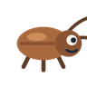
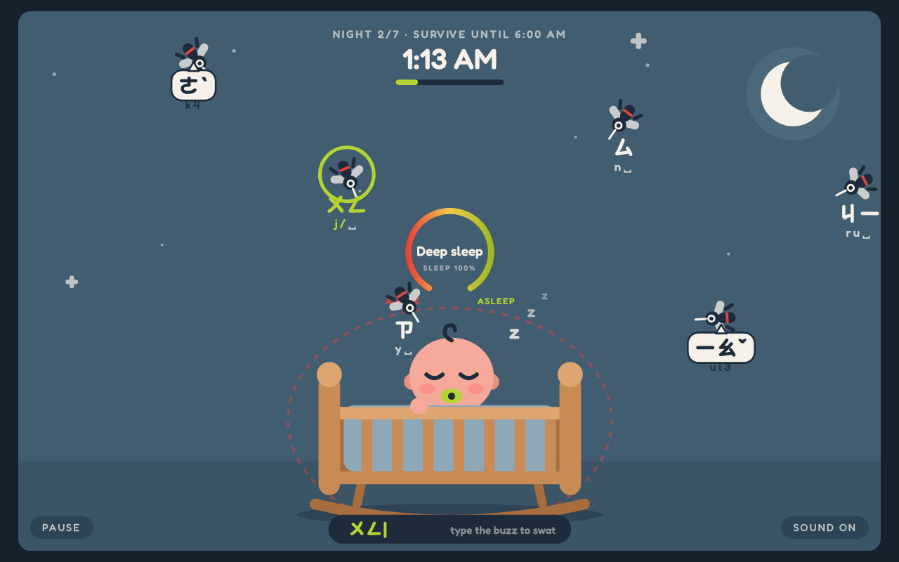
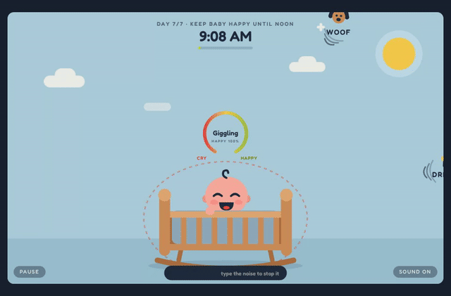
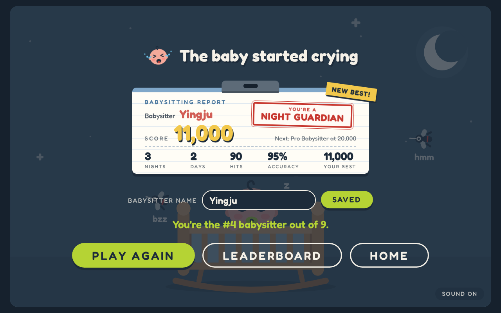
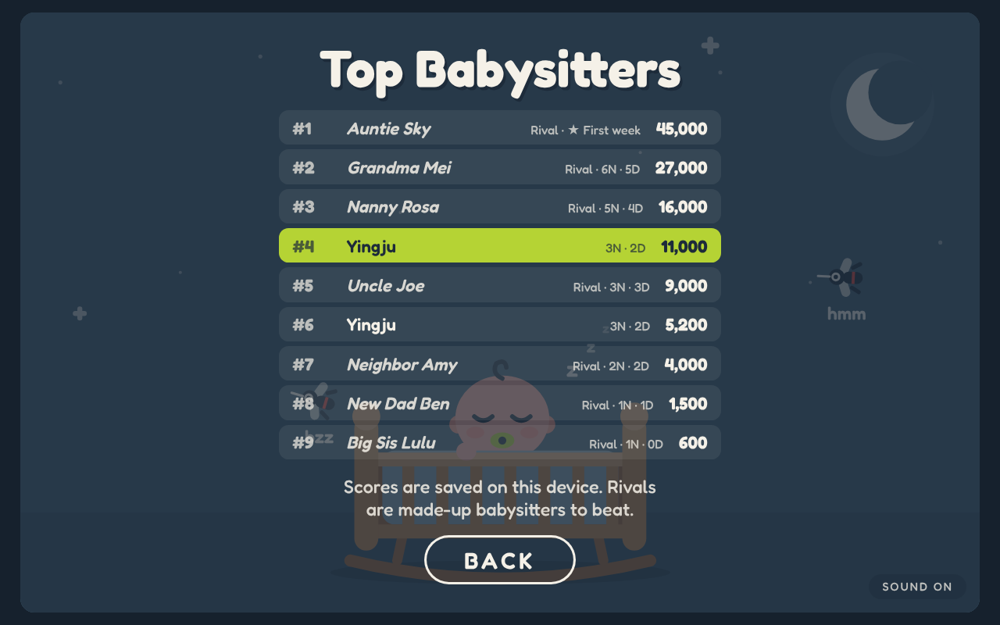
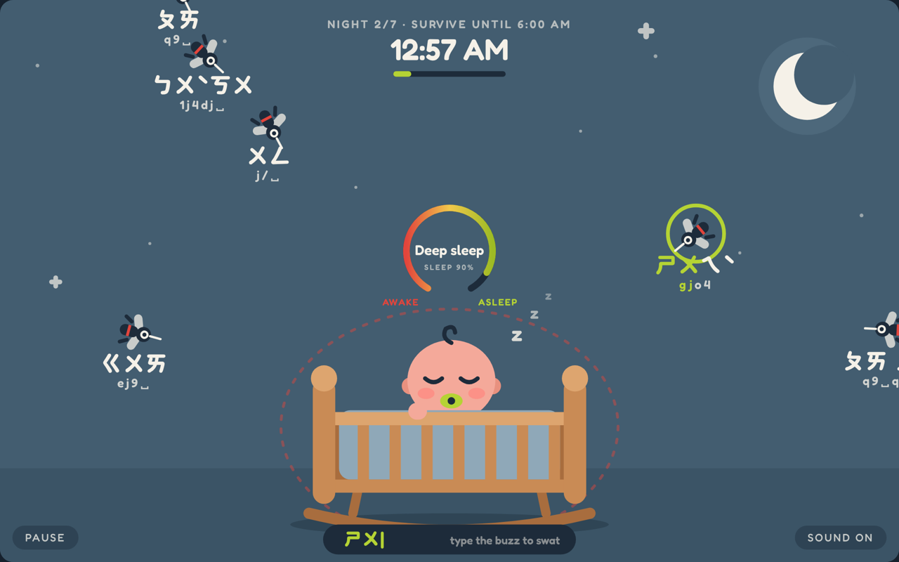

# Master AI Prompt Log & Workflow Analysis

**Mobile Version:** [github.com/yche1364-YJ/game-babysitter-mobile](https://github.com/yche1364-YJ/game-babysitter-mobile)

**Course:** AME 294: Games and AI — Creating Games with Artificial Intelligence  
**Assignment:** Portfolio Game 2 — Vibe-Coded Browser Game  
**Student Name:** Ying-Ju Chen  
**Project Title:** Babysitter  
**Repository URL:** [https://github.com/yche1364-YJ/game-babysitter](https://github.com/yche1364-YJ/game-babysitter)  
**Play Online (GitHub Pages):** [https://yche1364-yj.github.io/game-babysitter/](https://yche1364-yj.github.io/game-babysitter/)  
**Itch.io URL:** [https://yjcgame.itch.io/babysitter](https://yjcgame.itch.io/babysitter)  
**Presentation (PDF):** [docs/Babysitter-presentation.pdf](docs/Babysitter-presentation.pdf)

> **Babysitter** is a cozy typing game built on a Chinese pun: 打蚊子 (swatting mosquitoes) sounds almost the same as 打文字 (typing words). Mosquitoes fly at the crib at night and noises float in during the day. The player types each pest's sound to stop it. Survive seven nights and seven days to earn a Babysitter Certificate. A Zhuyin mode lets players type Zhuyin key positions instead of English.


### Game Mechanics

* **Core loop:** each round is one night (12:00–6:00 AM, 45 s) followed by one day (9:00 AM–noon, 40 s). Every pest carries a word. Type it to lock on, finish it to stop the pest.
* **Night:** keep the baby asleep. The sleep meter reads Deep sleep → Asleep → Restless → Stirring → Waking!
* **Day:** keep the baby laughing. The happy meter reads Giggling → Happy → Fussy → Teary → Crying! Each noise stopped gives back 3%.
* **Damage:** a pest that reaches the baby costs 10%, a wrong key 2%, and pests inside the red danger ring drain the meter every second. At 0% the game is over.
* **Progression:** every round, pests move about 12% faster and the gap between them is about 14% shorter, and the words get longer. Survive 7 nights and 7 days to win the Babysitter Certificate.
* **Scoring:** 10 × round per word, 100 × round per level survived. The score earns a title from Rookie Sitter to Super Nanny.

**New pests, round by round** (designed together with Claude: it drafted the roster as a table and I edited it):

| Round | Night: new pest | What it does | Day: new noise | What it does |
| :---- | :---- | :---- | :---- | :---- |
| 1 |  Mosquito | Type its buzz ("bzz", "zing") |  Everyday noises | "honk", "woof", "bang" float in |
| 2 |  Tiger mosquito | Big and slow; takes two buzzes. Talking mosquitoes also start ("snack", "getup") |  Jackhammer | Three noises in a row before it stops |
| 3 |  Zippy mosquito | Tiny and fast, with a wobble |  Neighbor's dog | Stop the bark and two puppies run out |
| 4 |  Shadow mosquito | Its buzz fades in and out, so you have to remember it |  Doorbell | Rings right next to the crib |
| 5 |  Fly | Hovers, then darts; hard to time |  Mail carrier | Keeps ringing from far away; every ring costs 2% |
| 6 |  Cockroach | Two scurry in along the floor |  Garbage truck | Drives across playing its song; stop all three parts before it leaves |
| 7 |  Mouse | Stops to sniff; lock on and it panics and runs |  Ice cream truck | Drives by and lets kids run out yelling |

Each new pest is introduced on the round card with a picture and one line about it.

**Zhuyin mode (for an extra challenge).** Zhuyin (Bopomofo) is the phonetic alphabet used only in Taiwan, so this mode is a challenge most players have never tried. Turn it on from the title screen and every pest shows Zhuyin symbols instead of English letters, with the matching keys printed underneath. There are two ways to type them:

* With a real Zhuyin input method, typing the way Taiwanese players normally do.
* In plain English keyboard mode, by pressing the keys shown under each word (for example `j / space`). Anyone can play it this way, even without knowing Zhuyin.

Both work because the game reads which physical key was pressed, not the character the input method produces.



**Ending animation.** Surviving day 7 plays a short animation I asked for: the baby happily climbs out of the crib while confetti falls, then the Babysitter Certificate appears.



---

## 1\. Toolchain & AI Session Inventory

| Category | Primary Tool / Platform | Model Version / Specification | Purpose in Project |
| :---- | :---- | :---- | :---- |
| **Code Scaffolding Agent** | Claude (Cowork mode, Claude desktop app) | `claude-opus-5-5` (identifier shown in the session) | Concept write-up, SVG mockups, an SVG scene and a `requestAnimationFrame` game loop, first as one HTML file, later split into `index.html`, `css/`, `js/` for GitHub |
| **Logic & Debugging Agent** | Claude (same session) | `claude-opus-5-5` | Typing/lock-on logic, enemy behaviours, night/day loop, scoring, leaderboard, Zhuyin key mapping, bug fixes, automated play-testing with a Playwright typing bot |
| **Audio / SFX Generator** | ElevenLabs | ElevenLabs Sound Effects | Day hit "pop", night "slap", baby crying on game over |
| **Music / Atmosphere** | ElevenLabs | ElevenLabs Sound Effects | 10-second "cute and cozy" clip, arranged into a 40-second background loop |
| **Visual Asset Pipeline** | Claude, drawing vector art directly as inline SVG code | `claude-opus-5-5` | Baby, crib, mosquitoes, flies, cockroach, mouse, day-noise icons, gauge, certificate. Flat style based on a reference image I supplied. |
| **Fonts** | Google Fonts | Fredoka, Huninn | Rounded UI font; cute rounded font for Zhuyin |
| **Leaderboard (GitHub Pages)** | Browser `localStorage`, no server | — | Scores saved on the player's device, ranked against made-up rival babysitters; optional Supabase online board |
| **Audio processing** | Claude (ffmpeg + Python in its sandbox) | — | Trimming silence, fades, volume, pitch, loop check, embedding audio in the single-file build |

---

## 2\. Code Development Prompts (Reward — Damage — End Loop)

*My prompts were written in Chinese. They are shown here in English translation, kept as close to the original wording as possible.*

### 2.1 Initial Setup & Boilerplate Scaffolding

* **Date / Session:** `2026-10-03`  
* **Agent Used:** Claude (Cowork)  
* **Target Objective:** Turn the idea into a concept, then build a playable browser game with a title page, a night level and a day level.

#### Exact Prompt Submitted:

Concept:

> I want to make a web game. Mom "types words" (打文字) to get the kid to sleep, so it's a shooter where you type. The closer the mosquito (蚊子) gets, the more the baby cries, so I have to kill it before it bites. Smooth out the logic and give me a short English summary.

First build, after about ten rounds of mockups and art direction:

> OK, build it. It's a browser game with three pages: the home page, then level 1, and when time runs out level 2 (daytime). Levels 1 and 2 alternate. Help me pick timings so players don't get bored.

#### Agent Output Summary & Key Changes:

* One self-contained `index.html`: inline CSS, an SVG scene (960×600 viewBox, scales to the window), HTML overlays for the title, cards, pause and game-over screens, and a single `requestAnimationFrame` loop. No libraries.
* All tunable numbers were put in one `CONFIG` object at the top so the game can be edited later (including with other AI tools).
* It ran on the first try. The agent's own screenshot test found one bug immediately: every overlay was visible at once (see Incident 1).

---

### 2.2 Implementing the Core Gameplay Triad (Reward — Damage — End)

* **Date / Session:** `2026-10-03` to `2026-10-06`  
* **Agent Used:** Claude (Cowork)  
* **Target Objective:** Program the three foundational gameplay pillars.

#### A. Reward Mechanic Prompt:

> Should there be a next level? It becomes daytime, with construction noise upstairs and noise outside the window, still as words. The baby is awake and crying; you type away the noises (same gameplay) so the baby stops crying and laughs.

> And at the end, a ranking of everyone who has played: "you are babysitter #N".

> Each round, each level should add a new enemy.

* **Implementation Outcome:** Every word typed is a hit: a burst ("SLAP!" at night, "POW!" by day), +10 × round points, and by day +3% happiness. Surviving a level adds +100 × round. Each round introduces a new character with a picture card. Game-over shows the score and the player's rank ("You're the #2 babysitter out of 12"), saved to a shared leaderboard.

#### B. Damage & Hazard Mechanic Prompt:

> Make the penalty 10%, and describe the meter as levels from happy to crying and asleep to awake, not seconds.

* **Implementation Outcome:** A ring gauge shows the baby's state in words (Deep sleep → Asleep → Restless → Stirring → Waking!, and Giggling → … → Crying!) plus a percentage. A pest reaching the baby costs 10%, a wrong key 2%, and pests inside the red danger ring drain it every second. The baby's face changes with the meter.

#### C. End State & Win/Loss Condition Prompt:

> A clear ending: survive seven days to win, then a short animation of the baby happily climbing out of the crib. Then a babysitter certificate.

* **Implementation Outcome:** Losing (meter at 0%) shows "The baby woke up" or "The baby started crying" with stats, a name box, Save score, Play again, Leaderboard and Home. Winning day 7 plays the climb-out animation with confetti, then a Babysitter Certificate with the player's name, date, score and a CERTIFIED seal.

---

### 2.3 Wiring Up the Web Audio API & Audio Triggers

* **Date / Session:** `2026-10-06`  
* **Agent Used:** Claude (Cowork)  
* **Target Objective:** Load my audio files, attach them to game events, and unlock audio after a user gesture.

#### Exact Prompt Submitted:

> Add sound effects and a looping background track — here are the files. Play this crying sound when the player loses. Use this sound for POW by day and adjust where it starts. Use this one for slap, quieter. Make sure every daytime hit is the pow and every night hit is the slap.

#### Implementation Outcome:

* One `AudioContext`, created and resumed on the player's first click or key press (browser autoplay policy). The cry and hit sounds are pre-decoded at that moment so they play with no delay.
* The music loops gaplessly through an `AudioBufferSourceNode` with `loop = true` (an `<audio loop>` tag leaves a gap). A low-pass filter and gain change with the scene: muffled and quiet at night, bright by day, ducked when paused or after losing.
* Hits play the recorded pop (day) or slap (night). Losing plays the baby crying. Separate volume settings: `musicVolume`, `popVolume`, `slapVolume`, `cryVolume`.
* Smaller cues (key click, lock-on ping, baby whimper, countdown bell, giggle, damage tone, win jingle) are synthesized with Web Audio oscillators.
* The GitHub version loads the four recorded clips from `assets/audio/`. The single-file version used on claude.ai embeds the same files as base64, so one loader handles both.

---

### 2.4 Results Screen, Titles & Rivals (Player Feedback Without a Server)

* **Date / Session:** `2026-10-07`  
* **Agent Used:** Claude (Cowork)  
* **Target Objective:** Keep the "compare and replay" feeling on GitHub Pages without a login or an online database, and make the results screen worth a screenshot.

#### Exact Prompt Submitted:

> Is there a way to keep the player experience without necessarily having a leaderboard?

> OK, do it.

> The title, like "You are a Lullaby Pro", should be highlighted. Otherwise a screenshot is meaningless.

> I think it should be changed using the Babysitter Certificate layout, but made different from it.

> Pull "The baby started crying" out and put it at the top of the report with a small crying-baby face next to it. Then flatten the layout to fit the proportions.

> The stamp can be a rectangle, to make it different from the final certificate. Keep "New best" on the right.

> Now tell me roughly which day each title corresponds to.

#### Implementation Outcome:

* **Local board with rivals:** scores are saved in the player's own browser (`localStorage`) and ranked together with seven made-up rival babysitters, so the board is never empty and there is always someone to beat. No server, no sign-in, nothing to fake.
* **Titles:** every game earns a title from its score, set in `CONFIG.titles`. Based on the typing bot's runs (9 perfect keys/s, about 47,000 points for a win):

  | Title | Score | Roughly reached on |
  | :---- | :---- | :---- |
  | Rookie Sitter | 0–999 | Day 1 |
  | Sleepy Helper | 1,000–3,999 | Day 2 |
  | Lullaby Pro | 4,000–9,999 | Day 3 |
  | Night Guardian | 10,000–19,999 | Days 4–5 |
  | Pro Babysitter | 20,000–34,999 | Days 5–6 |
  | Super Nanny | 35,000+ | Day 7 (about a win) |

  Slower typists stop fewer pests per round, so they may reach each title about a day later.
* **Babysitting Report (loss screen):** the headline and a wobbling crying-baby face sit above a clipboard note in the same paper-card style as the certificate. The card holds the babysitter's name, the score, the next title in small text and the stats row. The title is a rectangular red rubber stamp, deliberately different from the certificate's round gold seal. A yellow "New best!" sticker marks a personal record. On a win, the title is printed on the certificate instead.
* **Layout iterations (all from my screenshot reviews):** removed the in-game clock from the card (the stats already say how far you got), narrowed the card from 58% to 44% of the screen width, moved the stamp up and set it almost straight (1.5°), changed the sticker from green to yellow, and evened out the space above and below the card.
* **Save:** saves only the name and that game's result to the board, not an image of the report or certificate.

| Babysitting Report (after a loss) | Leaderboard (your games + made-up rivals) |
|---|---|
|  |  |

The leaderboard shows the top 10. Your latest saved game is highlighted in green, your other games are in plain text, and rivals are in italics, marked "Rival". The note under the list explains that scores stay on this device.

---

## 3\. Generative Audio & Sound Design Prompts

### 3.1 Sound 1: Reward SFX

* **Target Event:** A pest is stopped — daytime "POW!" (and a second sound for the night "SLAP!")  
* **Audio Generator:** ElevenLabs Sound Effects  
* **Exact Prompt / Acoustic Descriptors:**  

  Day pop:
  > One sharp and crisp bubble pop: "pow!" Clean, punchy, playful, and cartoon-like. Single sound only, very short, no reverb or background noise.

  Night slap:
  > One sharp: "slap" cute, playful, and cartoon-like. Single sound only, very short, no reverb or background noise.  

* **Iterations & Refinements:**  
  * Pop: the 1-second file had 0.27 s of silence before the sound. It was trimmed to 0.3 s so the pop lands with the visual burst, given a short fade, and lowered from 0.9 to 0.45 after play-testing ("the pop can be quieter").
  * Slap: this took six rounds. The raw slap felt too sharp against the soft music (about a third of its energy was above 3 kHz). Filtered and synthesized versions were rejected ("still a slap, just not so loud, more cartoonish and playful"). Final: the recording sped up 1.2× (higher, shorter, more cartoon-like), highs rounded off, 0.13 s, volume 0.35.  
* **Exported Filename:** `/assets/audio/reward_day_pop.wav`, `/assets/audio/reward_night_slap.wav`

---

### 3.2 Sound 2: Damage SFX

* **Target Event:** A pest reaches the baby (−10%), and a pest enters the red danger ring  
* **Audio Generator:** Created by Claude in code (Web Audio API oscillators), under my direction  
* **Exact Prompt / Acoustic Descriptors:**  

  There was no separate audio-generator prompt. The damage sound was built by the coding agent as part of the game, following my build request in Section 2.1 and my sound request in Section 2.3 ("I want to add some sound effects"). I reviewed it in play-testing and kept it quiet so it doesn't compete with the music and the crying sound.  

* **Iterations & Refinements:** The hit is a short falling sawtooth "ouch" tone with a shake of the baby. A soft two-note whimper plays when a pest enters the danger ring, limited to once every 2.5 seconds so it never stacks.  
* **Exported Filename:** — (generated at runtime)

---

### 3.3 Sound 3: End State SFX

* **Target Event:** Game over — the baby wakes up or starts crying  
* **Audio Generator:** ElevenLabs Sound Effects  
* **Exact Prompt / Acoustic Descriptors:**  

  > making the crying baby sound, soft and not too annoying and more cute not too sharp like baby just starting to cry  

* **Iterations & Refinements:** 5-second clip, converted to mono 24 kHz to keep the page small, with a 0.4 s fade-out because the original ended abruptly. Plays at 0.8 while the music drops to a quiet "game over" level so the cry stands out. Winning uses a synthesized four-note jingle with confetti instead.  
* **Exported Filename:** `/assets/audio/end_baby_cry.wav`

---

### 3.4 Ambient Music / Background Soundscape

* **Target Purpose:** Looping background music for the whole game  
* **Tool Used:** ElevenLabs Sound Effects  
* **Prompt & Settings:**  

  > Cute and cozy game background music with low-pitched marimba and soft wooden percussion. Warm, bouncy "boom boom" notes, playful and gentle, medium tempo. Avoid high-pitched xylophone, bells, chimes, and crystal sounds. good for night  

  Analysis: 10.0 s, loops cleanly (near-zero samples at both ends), roughly G major with a one-second rhythmic pattern. Converted to 24 kHz to save space.  

* **Iterations & Refinements:** In play-testing the music felt like it "only plays the first few seconds, then loops", because the same 10-second clip repeated every 10 seconds and its first 4 seconds were much quieter than the rest. The agent turned it into a 40-second arrangement built only from my clip: the original, the clip shifted down 5 semitones (to D), the original with its one-second bars reordered, and the clip shifted down 3 semitones. It only shifts downward to keep the low marimba sound I asked for, and keeps every bar on the beat so the 40-second loop is seamless. It also gently raised the quiet opening. The loop now repeats every 40 seconds instead of every 10.  

* **Exported Filename:** `/assets/audio/bg_music.wav`

---

## 4\. Debugging, Error Recovery & Friction Log

### Incident 1: Every screen showed at the same time

* **Symptom / Error Message:** The agent's first automated screenshot showed the title, the level card, "Paused" and "The baby woke up" stacked on top of each other.
* **Root Cause:** The overlays were hidden with the HTML `hidden` attribute, but the CSS rule `.overlay { display: flex }` overrode it.
* **AI Follow-up Prompt Used to Fix:** None. The agent caught this in its own screenshot check before I saw it.
* **Resolution:** Added `[hidden] { display: none !important; }`.

---

### Incident 2: Only one leaderboard entry after two games

* **Symptom / Error Message:** I played twice but only one score appeared, under the name "0".

  > I played twice; there should be two entries on the leaderboard, but there aren't.

* **Root Cause:** The leaderboard stored one record per player and only replaced it on a new best, so a lower second score was silently dropped. It was a design assumption by the AI, not a crash.
* **AI Follow-up Prompt Used to Fix:** The message above.
* **Resolution:** Each player's record now holds a list of their games (up to 25). The board flattens every game from every player and sorts by score. Old single-score records were migrated.

---

### Incident 3: The name box disappeared after the first save

* **Symptom / Error Message:**

  > After replaying I can't enter a name anymore. Every time the player loses, they should be able to type their own name.

* **Root Cause:** After the first save, the code switched to auto-saving and hid the form, so a second player on the same computer couldn't enter their name.
* **AI Follow-up Prompt Used to Fix:** The message above.
* **Resolution:** The name box now appears after every game, pre-filled with the last name and selected so a new player can type over it. Saving is always the player's choice.

---

### Incident 4: The game could not be beaten, and the AI could not hear its own sounds

* **Symptom:** When I asked the agent to play to the end, it could not "play" like a person, so it wrote a Playwright bot that sends real key presses at a fixed speed. The bot showed that even at 9 perfect keys per second the game was lost on night 7. Separately, the agent cannot hear audio, so its slap-sound edits were judged only from waveforms and missed what I wanted several times.

  > Can you play it once for me, all the way to the end?

  > The goal is that a very fast typist can almost beat it.

* **Root Cause:** The late-round spawn rate ramped to a pest every 0.24 s with up to 16 on screen.
* **Resolution:** Added `minSpawnEvery: 0.46` and `maxOnScreenCap: 11`, then re-ran the bot after each content change. Final: 9 keys/s wins about 3 runs in 4, 7 keys/s reaches the last day. For audio, the agent built small listening pages (with the night music underneath and three hits in a row) so I could choose by ear.

---

### Incident 5: The leaderboard did not save on GitHub Pages

* **Symptom:** Played online from GitHub Pages, the game could not save scores to a shared leaderboard.

  > When I play it online, the leaderboard can't save. I don't want a login, but I still want a leaderboard. Can you do that?

* **Root Cause:** The shared leaderboard used Claude's built-in artifact storage, which only exists when the game is opened on claude.ai. A plain web page on GitHub Pages has no server to store scores.
* **First fix:** The agent added an online mode using a free Supabase database (no sign-in for players, only for me as the developer). It worked in a mock test, but it meant running a server, the risk of fake scores, and a project that pauses after a week of no use.
* **Follow-up prompt:**

  > Is there a way to keep the player experience without necessarily having a leaderboard?

* **Resolution:** The GitHub Pages version now works with no server at all. Scores are saved in the player's browser, and the board mixes them with seven made-up rivals, so there is something to beat from the very first game. Every game also earns a title by score (Rookie Sitter, Sleepy Helper, Lullaby Pro, Night Guardian, Pro Babysitter, Super Nanny). When the baby wakes up or cries, the results show the headline with a small crying-baby face, then a "Babysitting Report": a clipboard note in the same paper-card style as the certificate, so the two screens feel related but clearly different. The title is a rectangular red rubber stamp ("You're a Lullaby Pro"), deliberately different from the round gold seal on the certificate, with the next title in small text, and a yellow "New best!" sticker marks a personal record. On a win the title is printed on the certificate. The Supabase option is still in the code, switched off, with steps in `SUPABASE_SETUP.md`.

  

---

### Incident 6: The Zhuyin input method swallowed key presses

* **Symptom:** With a Zhuyin input method turned on, typing in Zhuyin mode did nothing, because the input method holds the keys while it composes a character.
* **Root Cause:** The game compared the typed character, which the input method never sends while composing.
* **Resolution:** The game now reads the physical key (`event.code`) and maps it to the standard Zhuyin keyboard layout, so it works with a Zhuyin input method on, or in plain English mode by following the key hints.

---

## 5\. Human-in-the-Loop Curation & Analytical Reflection

*(200–300 words analyzing the collaborative dynamic between you and the AI tools)*

> **Reflection Prompting Questions to Consider:**
>
> - Where did the AI coding agent accelerate your workflow the most?
> - Where did the AI fall short, hallucinate obsolete API methods, or introduce subtle bugs?
> - How did your personal game design intuition guide decisions regarding pacing, difficulty, and audio volume balancing?
> - How did designing sound effects upfront influence how the game feel evolved?

My original idea was a game about swatting mosquitoes. In Chinese, "typing words" (打文字) and "swatting mosquitoes" (打蚊子) sound very similar, and a typo I made while prompting the AI turned into a new idea: turning typing into the attack is a lot of fun. Besides English, I also added a Zhuyin version, using the phonetic symbols unique to Taiwan.

AI tools helped my development a great deal. I often have ideas but need to see them made right away, and AI can do that. Because results appear immediately, I can adjust them on the spot and refine my original idea. The AI could also revise every part I pointed out. For sound, we first discussed options separately and only applied the result to the game once we agreed. It generated each screen layout for me, and I changed the details from there. Even the ending animation I wanted at the end could be generated right away. For the game mechanics, I asked it for a table of the current levels with their gameplay and an analysis, then adjusted the content directly in that table, which made everything well organized.

Through repeated testing, asking the AI to play-test the game and send me screenshots, and giving it examples, I shaped the interface I wanted. I came up with the ideas and discussed them with the AI; it gave me results to judge and choose from. That let me focus on creative thinking, and it became a very capable assistant. The process sparked a lot of creativity and refined the game into the current version.

---

## 6\. Asset Attribution & Licensing Table

| Asset Filename | Asset Type | AI Model / Source Tool | License / Terms | Prompt / Origin Details |
| :---- | :---- | :---- | :---- | :---- |
| `index.html`, `css/style.css`, `js/config.js`, `js/game.js` | Game code (HTML/CSS/JS) | Claude (`claude-opus-5-5`) | Educational project | Written by the agent from the prompts in Section 2 |
| `reward_day_pop.wav` | SFX (Audio) | ElevenLabs Sound Effects | ElevenLabs Terms of Service (paid Creator plan) | Prompt in Sec 3.1; trimmed and lowered by the agent |
| `reward_night_slap.wav` | SFX (Audio) | ElevenLabs Sound Effects | ElevenLabs Terms of Service (paid Creator plan) | Prompt in Sec 3.1; sped up 1.2× and softened by the agent |
| `end_baby_cry.wav` | SFX (Audio) | ElevenLabs Sound Effects | ElevenLabs Terms of Service (paid Creator plan) | Prompt in Sec 3.3; fade-out added |
| `bg_music.wav` | Music (Audio) | ElevenLabs Sound Effects | ElevenLabs Terms of Service (paid Creator plan) | Prompt in Sec 3.4; arranged into a 40 s loop by the agent |
| Damage / UI cues | SFX (synthesized) | Web Audio API, code by Claude | Part of `js/game.js` | Made by the agent under my direction (Sec 3.2) |
| Characters, crib, icons, certificate, report card | Vector art (inline SVG + CSS) | Claude, drawn as code | Part of `index.html` and `css/style.css` | Flat style from a reference image I supplied; characters are original |
| Fredoka, Huninn | Fonts | Google Fonts | SIL Open Font License 1.1 | Loaded from fonts.googleapis.com |
| `screenshots/*` | Images | Captured by the agent with Playwright | Same as the project | Screens from the finished game |

---

### Running the game

Play at [yche1364-yj.github.io/game-babysitter](https://yche1364-yj.github.io/game-babysitter/). A keyboard is needed and no sign-in is needed.

```
game-babysitter/
├── index.html            page markup: SVG scene and screens
├── css/style.css         all styles
├── js/config.js          every tunable number: timing, enemies, words, scoring, rivals, titles
├── js/game.js            game logic: loop, typing, enemies, audio, leaderboard, results
├── assets/audio/         ElevenLabs music and sound effects (WAV)
├── screenshots/          images used in this README
├── README.md
├── SUPABASE_SETUP.md     optional: turn on a shared online leaderboard
└── docs/                 presentation slides (PDF)
```

**Publish:** upload the contents of this folder to the repo root (GitHub → Add file → Upload files), then Settings → Pages → Deploy from a branch → `main`, `/ (root)`.

**Play locally:** the recorded sounds are loaded from `assets/audio/`, which browsers block for pages opened straight from disk. Run `python3 -m http.server` in this folder and open `http://localhost:8000`. Opened by double-click, the game still runs, but only with the synthesized sounds.

**Leaderboard:** the Claude-hosted version has a shared online leaderboard. The GitHub Pages version keeps scores on each player's device and ranks them against seven made-up rivals (Big Sis Lulu at 600 up to Auntie Sky at 45,000). A shared online board can be turned on later with a free Supabase project ([SUPABASE_SETUP.md](SUPABASE_SETUP.md)).

| Night | Day | Babysitting Report |
|---|---|---|
|  |  |  |

| Certificate | Leaderboard | Zhuyin mode |
|---|---|---|
|  |  |  |

